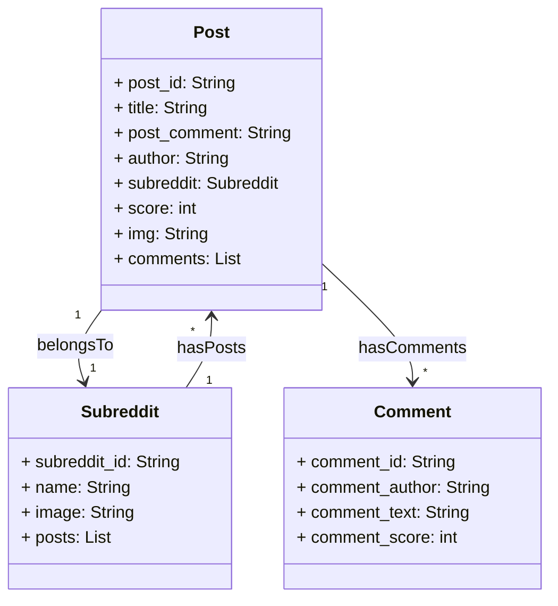

```mermaid
classDiagram
    class Post {
        + post_id: String
        + title: String
        + post_comment: String
        + author: String
        + subreddit: Subreddit
        + score: int
        + img: String
        + comments: List<Comment>
    }

    class Subreddit {
        + subreddit_id: String
        + name: String
        + image: String
        + posts: List<Post>
    }

    class Comment {
        + comment_id: String
        + comment_author: String
        + comment_text: String
        + comment_score: int
    }

    Post "1" --> "1" Subreddit : belongsTo
    Subreddit "1" --> "*" Post : hasPosts
    Post "1" --> "*" Comment : hasComments
```